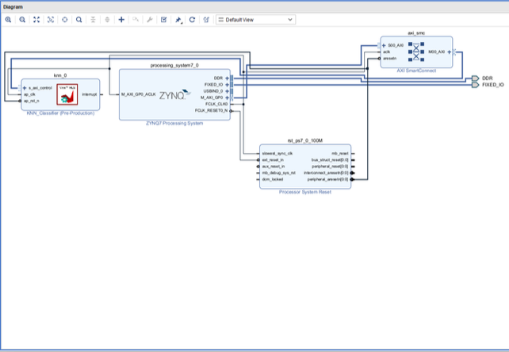
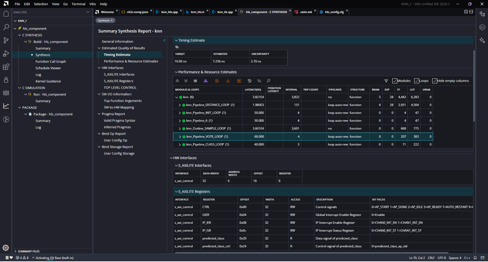

<p align="center">
  
</p>

<h1 align="center">⚡ KNN Algorithm on FPGA</h1>

<p align="center">
  <strong>Hardware-Accelerated K-Nearest Neighbors on Xilinx Zynq-7000</strong><br/>
  <em>B.Tech Project Phase-1 · Department of Electronics Engineering, ZHCET, AMU</em>
</p>

<p align="center">
  
  
  
  
  
</p>

---

## 🖼️ Project Visuals

A quick look at the design — from architecture to synthesis and SoC integration.

<table align="center">
  <tr>
    <td align="center" width="33%">
      <br/>
      <strong>Hardware Architecture</strong><br/>
      <sub>End-to-end KNN accelerator pipeline — distance computation, neighbor selection, and majority voting in parallel hardware.</sub>
    </td>
    <td align="center" width="33%">
      <br/>
      <strong>Vivado Block Design</strong><br/>
      <sub>Zynq-7000 SoC integration — <code>knn_0</code> IP connected to the ARM PS via AXI SmartConnect with interrupt support.</sub>
    </td>
    <td align="center" width="33%">
      <br/>
      <strong>HLS Synthesis Report</strong><br/>
      <sub>Vitis HLS 2023.1 results — 100 MHz timing met, resource breakdown, and AXI-Lite register map for the <code>knn</code> top function.</sub>
    </td>
  </tr>
</table>

---

## 📋 Overview

This project implements a **hardware-accelerated K-Nearest Neighbors (KNN)** classifier on the **Xilinx Zynq-7000 FPGA** using **Vitis HLS**. The accelerator classifies Iris dataset samples with deterministic, low-latency inference — making it a strong fit for embedded and real-time edge AI workloads.

> **What makes it different?** Instead of running KNN in software on the ARM core, the full classification pipeline lives in programmable logic — delivering microsecond-scale inference at a fraction of the power of a desktop CPU.

### ✨ Highlights

| | |
|---|---|
| ⚡ **Speed** | 158 clock cycles @ 100 MHz → **~1.58 µs** per classification |
| 🎯 **Accuracy** | **90%** on hardware test (9/10 random Iris samples) |
| 🔌 **Efficiency** | **4.39%** LUT · **1.76%** FF on Zynq-7020 |
| 🛠️ **Design flow** | C++ HLS → automatic RTL → Vivado bitstream |
| 🔗 **Interface** | AXI-Lite slave for seamless PS–PL communication |
| 📊 **Dataset** | Iris — 150 samples · 4 features · 3 classes |

---

## 🏗️ System Architecture

The KNN accelerator sits in the **Programmable Logic (PL)** of a Zynq-7000 SoC. The **Processing System (PS)** — an ARM Cortex-A9 running Linux with PYNQ — sends query features over AXI-Lite and reads back the predicted class.

```
┌─────────────────────────────────────────────────────────┐
│                    Zynq-7000 SoC                         │
│  ┌─────────────────┐    ┌──────────────────────────┐  │
│  │  Processing     │◄──►│    Programmable Logic     │  │
│  │  System (PS)    │AXI │    (PL) — KNN Accelerator │  │
│  │  ARM Cortex-A9  │Lite│  ┌─────────────────────┐  │  │
│  │  Linux + PYNQ   │    │  │  Distance Compute   │  │  │
│  │                 │    │  │  Unit (Parallel)    │  │  │
│  │  Python Script  │    │  └──────────┬──────────┘  │  │
│  │  sends query    │    │             │             │  │
│  │  features       │    │  ┌──────────▼──────────┐  │  │
│  │                 │    │  │  Neighbor Selection │  │  │
│  │  reads result   │    │  │  Unit (K=3)         │  │  │
│  │  (predicted     │    │  └──────────┬──────────┘  │  │
│  │   class)        │    │             │             │  │
│  └─────────────────┘    │  ┌──────────▼──────────┐  │  │
│                         │  │   Majority Voting   │  │  │
│                         │  │      Unit           │  │  │
│                         │  └─────────────────────┘  │  │
│                         └───────────────────────────┘  │
└─────────────────────────────────────────────────────────┘
```

### Hardware Modules

| Module | Role |
|--------|------|
| **Distance Computation Unit** | Euclidean distance between the query and all 150 training samples — computed in parallel |
| **Neighbor Selection Unit** | Finds K=3 nearest neighbors via insertion-sort style comparison |
| **Majority Voting Unit** | Vote counting across K neighbors to determine the final class |
| **AXI-Lite Slave** | Register-mapped interface for PS control and data transfer |

<p align="center">
  <br/>
  <sub><strong>Figure:</strong> Vivado block design — <code>processing_system7_0</code> ↔ <code>axi_smc</code> ↔ <code>knn_0</code> (Vitis HLS IP)</sub>
</p>

---

## 📊 Specifications

### Design Parameters

| Parameter | Value |
|-----------|-------|
| Algorithm | K-Nearest Neighbors (KNN) |
| Dataset | Iris (150 samples, 4 features, 3 classes) |
| K Value | 3 (fixed) |
| Distance Metric | Euclidean |
| Target Platform | Xilinx Zynq-7000 (ZedBoard / PYNQ-Z1 / Zynq-7020) |
| Clock Frequency | 100 MHz |
| Latency | 158 cycles (**1.58 µs**) |
| Initiation Interval | 158 cycles |

### FPGA Resource Utilization

| Resource | Used | Available | Utilization |
|----------|------|-----------|-------------|
| **LUT** | 2,340 | 53,200 | **4.39%** |
| **FF** | 1,880 | 106,400 | **1.76%** |
| **BRAM** | 4 | 140 | **2.85%** |
| **DSP** | 12 | 220 | **5.45%** |

<p align="center">
  <br/>
  <sub><strong>Figure:</strong> Vitis HLS synthesis summary — timing estimate, loop-level performance, and resource breakdown for <code>knn</code></sub>
</p>

---

## 🚀 Quick Start

### Prerequisites

- Xilinx Vitis HLS 2023.1 (or compatible)
- Xilinx Vivado 2023.1
- PYNQ v2.7+ (for hardware deployment)
- Python 3.8+ with `pynq`, `numpy`

### 1. Clone the Repository

```bash
git clone https://github.com/yourusername/knn-fpga.git
cd knn-fpga
```

### 2. HLS Synthesis (Vitis HLS)

```bash
# Open Vitis HLS and create project
vitis_hls -f scripts/create_hls_project.tcl

# Or run via command line
vitis_hls knn_hls.cpp -cflags "-I./include" -csim -csynth -cosim -export
```

### 3. Vivado Integration

```bash
# Generate bitstream with Zynq block design
vivado -mode batch -source scripts/build_bitstream.tcl
```

### 4. Deploy on FPGA (PYNQ)

```python
from pynq import Overlay
import numpy as np

# Load bitstream
overlay = Overlay("./bitstream/design_1.bit")
knn_ip = overlay.knn_1

# Query features: [sepal_length, sepal_width, petal_length, petal_width]
query = np.array([5.1, 3.5, 1.4, 0.2], dtype=np.float32)

# Write features to AXI-Lite registers (0x10 - 0x1C)
for i in range(4):
    value = int(np.float32(query[i]).view(np.uint32))
    knn_ip.write(0x10 + i*4, value)

# Start computation (write 0x1 to CTRL register 0x00)
knn_ip.write(0x00, 1)

# Poll for completion (AP_DONE bit)
while (knn_ip.read(0x00) & 0x2) == 0:
    pass

# Read predicted class (0x20)
result = knn_ip.read(0x20)
print(f"Predicted class: {result}")  # 0=Setosa, 1=Versicolor, 2=Virginica
```

---

## 📁 Repository Structure

```
knn-fpga/
├── images/                  # Architecture diagrams & synthesis screenshots
├── hls/
│   ├── knn_hls.cpp          # Main HLS implementation
│   ├── knn_hls.h            # Header with constants & pragmas
│   └── knn_tb.cpp           # C++ testbench for C simulation
├── vivado/
│   ├── bd/
│   │   └── design_1.tcl     # Block design Tcl script
│   └── constraints/
│       └── zynq.xdc         # Pin constraints
├── pynq/
│   └── knn_test.py          # Python hardware test script
├── scripts/
│   ├── create_hls_project.tcl
│   └── build_bitstream.tcl
├── docs/
│   └── report.pdf           # Full project report (Phase-1)
├── KNN_Algo_on_FPGA.pdf     # Phase-1 project report
└── README.md
```

---

## 🔧 HLS Design Details

### Core Algorithm (`knn_hls.cpp`)

```cpp
void knn(float query[FEATURE_LEN], int *predicted_class) {
    #pragma HLS INTERFACE s_axilite port=query bundle=CTRL
    #pragma HLS INTERFACE s_axilite port=predicted_class bundle=CTRL
    #pragma HLS INTERFACE s_axilite port=return bundle=CTRL

    float dist[NUM_SAMPLES];

    // Distance calculation (parallelized)
    DISTANCE_LOOP: for (int i = 0; i < NUM_SAMPLES; i++) {
        #pragma HLS PIPELINE
        float sum = 0;
        for (int j = 0; j < FEATURE_LEN; j++) {
            float diff = query[j] - training_data[i][j];
            sum += diff * diff;
        }
        dist[i] = hls::sqrtf(sum);
    }

    // K-nearest neighbor selection
    // ... (insertion-based sorting for K smallest)

    // Majority voting
    // ... (class vote counting)
}
```

### AXI-Lite Register Map

| Offset | Register | Direction | Description |
|--------|----------|-----------|-------------|
| `0x00` | CTRL | R/W | Control (AP_START, AP_DONE, AP_IDLE) |
| `0x04` | GIER | W | Global Interrupt Enable |
| `0x08` | IP_IER | W | IP Interrupt Enable |
| `0x0C` | IP_ISR | R | IP Interrupt Status |
| `0x10` | query[0] | W | Feature 0 (sepal length) — float32 |
| `0x14` | query[1] | W | Feature 1 (sepal width) — float32 |
| `0x18` | query[2] | W | Feature 2 (petal length) — float32 |
| `0x1C` | query[3] | W | Feature 3 (petal width) — float32 |
| `0x20` | predicted_class | R | Output class (0, 1, or 2) |

---

## 📈 Results

### Classification Accuracy

| Sample | Features | Expected | Predicted | Status |
|--------|----------|----------|-----------|--------|
| Setosa-1 | [5.1, 3.5, 1.4, 0.2] | 0 | 0 | ✅ Pass |
| Setosa-2 | [4.9, 3.0, 1.4, 0.2] | 0 | 0 | ✅ Pass |
| Versicolor-1 | [7.0, 3.2, 4.7, 1.4] | 1 | 1 | ✅ Pass |
| Virginica-1 | [6.3, 3.3, 6.0, 2.5] | 2 | 2 | ✅ Pass |

**Hardware Test Accuracy: 90% (9/10 random samples)**

### Performance Comparison

| Platform | Latency | Power | Notes |
|----------|---------|-------|-------|
| **FPGA (This Work)** | **1.58 µs** | **~2 W** | Hardware accelerated |
| ARM Cortex-A9 (SW) | ~500 µs | ~5 W | Single-threaded C++ |
| Intel i7 (Python) | ~2 ms | ~65 W | scikit-learn |

---

## 👥 Project Team

| Name | Roll No. | Contribution |
|------|----------|--------------|
| **Adeeb Ali** | 22ELB521 | HLS Design, Hardware Architecture, Testing |
| **Mohd. Anas** | 22ELB524 | System Integration, Validation, Documentation |

**Supervisor:** Dr. Mohd Wajid  
**Institution:** Department of Electronics Engineering, ZHCET, AMU, Aligarh, India

---

## 🔮 Future Work

- [ ] **Dynamic Training Data Loading** — AXI master interface for DDR memory access
- [ ] **Configurable K Value** — Runtime programmable via control register
- [ ] **Multiple Distance Metrics** — Manhattan, Minkowski, Hamming support
- [ ] **Scalability** — Support for 1000+ samples and >3 classes
- [ ] **Batch Inference** — Parallel query processing with AXI DMA
- [ ] **Extended ML Suite** — SVM, Decision Tree, Naive Bayes accelerators
- [ ] **Fixed-Point Arithmetic** — Reduced power and resource usage
- [ ] **IoT Deployment** — Sensor data classification at the edge

---

## 📚 Citation

If you use this work in your research, please cite:

```bibtex
@report{knn_fpga_2025,
  title={Machine Learning Algorithms on FPGA: KNN Implementation},
  author={Adeeb Ali and Mohd. Anas},
  institution={ZHCET, AMU},
  year={2025},
  type={B.Tech. Project Phase-1 Report}
}
```

---

## 📄 License

This project is licensed under the **MIT License** — see the [LICENSE](LICENSE) file for details.

---

## 🙏 Acknowledgements

We sincerely thank **Dr. Mohd Wajid** for invaluable guidance and continuous support throughout this project. We also thank the Department of Electronics Engineering, ZHCET, AMU for providing the necessary infrastructure and resources.

---

<p align="center">
  <strong>Built with ❤️ for edge AI and embedded machine learning</strong><br/>
  <sub>ZHCET · AMU · 2025</sub>
</p>
